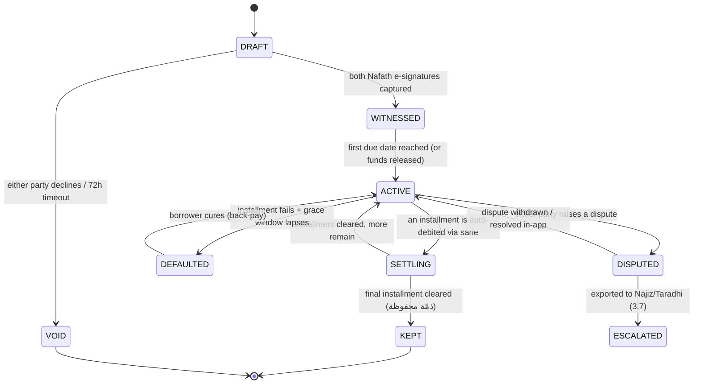

#ahd #layer/product #agent/4

# Ahd — Layer 4: Product Depth, Modeling & the Deepened Prototype

> One product. One spine: **write it, witness it, settle it.** Everything below either closes a named gap or is cut. The bank lends nothing; Ahd is an *amana/wakala* record-keeper + settlement agent, not an adjudicator.

---

## 1. Audit findings (condensed; full version in `audit-product.md`)

The shipped prototype is a deterministic, zero-error, RTL **5-slide flow** that *looks* like the product but whose three load-bearing mechanisms are mocked or absent: (1) there is **no `ahd` state machine** — only a `step` counter; (2) the "tamper-evident record" is a **single non-cryptographic FNV-1a hash** mislabelled as legally admissible; (3) the **riba-check is a hard-coded string** that inspects nothing. The flagship data moment, **Muqassa**, is genuinely computed but makes two breakable claims — "minimum transfers" (greedy ≠ optimal) and silent **cross-party netting** that manufactures obligations between non-consenting strangers. The **fee model is unspecified**, so the bank's cut has unknown riba status. Trust-capital, recurring agreements, family-circle, guest onboarding are **named but unmodelled**. These are the things I close.

---

## 2. Gap register (severity)

Critical: **G1** no state machine · **G2** fake integrity record · **G3** fake riba-check · **G4** Muqassa over-claim + non-consensual netting · **G5** unspecified fee. High: **G6** rounding · **G7** trust-capital model · **G8** seed bank · **G9** module map · **G10** Nafath payload/failure · **G11** distrust/cold-start mechanism. Med: **G12** cut-line · **G13** climax · **G14** dispute export. (Full table: `gaps-product.md`.)

---

## 3. Deep resolutions — the bulk

### 3.1 The `ahd` data model (closes part of G1, G6, G14)

An *ahd* is an immutable **header** + an append-only **event log**. Nothing is mutated in place; state is *derived* by folding events. This is what makes the record tamper-evident *and* gives MoJ a clean export.

```
Ahd {
  id:            "AHD-" + base32(seq)            // human-quotable
  type:          QARD_HASSAN | SHARED_COST | DEFERRED | PROMISE
  lender:        PartyRef { nationalIdHash, displayName }
  borrower:      PartyRef
  principal:     int   // halalas (integer money — NO floats)
  currency:      "SAR"
  schedule:      Installment[]   // see 3.4
  clauses:       { riba:false, latePenalty:false, graceByMaruf:true }
  createdAt:     logicalClock    // deterministic, not Date.now()
  status:        DERIVED         // never stored; folded from events
}
Installment { seq, dueLabel, amount:int /*halalas*/, status }
Event { seq, prevHash, type, payload, actor, hash }   // the chain (3.3)
```

Money is stored as **integer halalas** (1 SAR = 100 halalas). Floats are banned: this kills G6 at the type level — `5000.00 SAR` is `500000` halalas, and the remainder is distributed deterministically (3.4), so the schedule *always* sums to exactly the principal. A qard hassan must return principal exactly; integer money makes "exactly" provable.

### 3.2 The state machine (closes G1)



Every transition is an **event** appended to the log. `status` is computed by `fold(events)` — so the UI can render *any* state from seed data, and the demo can jump to a defaulted/disputed agreement instantly (closes G8 dependency). Critically, **DEFAULTED is not a punishment state**: no penalty accrues (that would be riba); it only changes the *reminder tone* and unlocks the *export-to-MoJ* affordance. The bank never sanctions; it records.

### 3.3 Real tamper-evident record: a hash-chain over events (closes G2)

Replace the single FNV hash with an **event hash-chain** (genesis-linked), the standard ledger-integrity construction:

```
h_0 = H( "AHD-GENESIS" || ahd.canonicalHeader )
h_i = H( h_{i-1} || canonical(event_i) )
recordRoot = h_n     // the value printed on the certificate
```

`H` in the offline demo can stay FNV-**but relabelled honestly** as a *demo digest*; the **seam** is one line — `const H = SHA256_via_WebCrypto` — and `crypto.subtle.digest('SHA-256', ...)` is available offline in every modern browser, so we can ship **real SHA-256** with zero network. The on-screen label changes from the over-claim "مقبولة كدليل" to the *defensible*:

> **«سجلٌّ سليم التسلسل — كل تعديلٍ لاحقٍ يكسر السلسلة. مهيّأ للتقديم كدليلٍ إلكتروني وفق نظام الإثبات (م/٤٣، ٢٠٢٢)؛ القبول النهائي تقدير القاضي.»**

This matches what the law actually says: an e-record is treated as **original** if integrity is preserved from finalization, otherwise as **presumptive evidence** — admissibility is a *judicial determination*, not a property the app can grant itself (see §5). The chain *demonstrates* the integrity precondition; it does not *assert* the verdict. That single honesty move converts the kill-line into a strength.

**The signing seam (closes G10):** Nafath authenticates *identity*; the legally-weighted **e-signature** is produced by a CST/DGA-licensed Trust Service Provider (TSP) such as emdha invoked *via* Nafath. So the e-sign event payload is:
```
SignEvent { actor, nationalIdHash, signedDigest: recordRootAtSign,
            tsp:"emdha", method:"NAFATH", ts:logicalClock, result:OK|DECLINE|TIMEOUT }
```
The signer is shown the **document digest they are signing** — not a blank progress bar — and DECLINE/TIMEOUT are real branches (→ VOID). That is genuine witnessing, honestly mocked.

### 3.4 Real schedule with deterministic remainder (closes G6)

```
function buildSchedule(principalHalalas, n):
    base = principalHalalas div n            // integer
    rem  = principalHalalas mod n            // 0..n-1
    # distribute the remainder onto the FIRST `rem` installments (largest-first)
    return [ base + (i < rem ? 1 : 0)  for i in 0..n-1 ]
    # invariant: sum(schedule) == principalHalalas  EXACTLY
```
Example: 5000 SAR / 3 = 500000 halalas / 3 → `[166667, 166667, 166666]` = 500000 exactly = 1666.67 + 1666.67 + 1666.66 SAR. Borrower pays principal to the halala, never a fraction more. The invariant is assertable in code and *shown* as "المجموع = أصل القرض تمامًا."

### 3.5 The riba/penalty checker — a real rule engine (closes G3)

A small **deterministic clause linter**, not an LLM and not a string. It runs over the *structured* terms (and, as defense-in-depth, a keyword scan of any free-text the user adds). It is a *checker*, not a *mufti* — it flags and blocks; it never issues a fatwa.

```
RIBA_RULES = [
  R1: any installment.amount summed > principal           -> BLOCK "زيادة على الأصل (ربا)"
  R2: clauses.latePenalty == true                          -> BLOCK "غرامة تأخير (ربا الجاهلية)"
  R3: type==QARD_HASSAN && clauses.riba==true              -> BLOCK
  R4: free-text matches /فائدة|نسبة|%|غرامة|عمولة على المبلغ/ -> WARN + human review
  R5: graceByMaruf == false                                -> WARN "السنة: الإمهال بالمعروف"
]
verdict = BLOCK if any BLOCK else (WARN if any WARN else CLEAN)
```
Now the badge is *earned*: feed it a 10%-late term and it goes red and disables the Nafath button. This is demoable as a live toggle ("watch what happens if I add a penalty") — turning the weakest mocked feature into an interactive proof point. **R1 (sum-of-installments ≤ principal)** is the mathematical heart: combined with §3.4 it *guarantees* qard hassan returns exactly principal.

### 3.6 Muqassa, done correctly and honestly (closes G4)

Two fixes, one honesty edit.

**(a) Stop over-claiming optimality.** Minimizing the *number* of transfers in debt-netting is NP-hard (equivalent to a partition/subset-sum problem). The greedy debtor↔creditor algorithm is **min-cash-flow heuristic**, near-optimal in practice and *always* ≤ (parties − 1) transfers. Relabel the claim from "أقل عدد من التحويلات" (false) to the true and still-impressive:

> **«من ٩ التزامات إلى تسويةٍ على مستوى الصافي بما لا يتجاوز (عدد الأطراف − ١) تحويلًا — كل طرفٍ إمّا يدفع فقط أو يقبض فقط، لا الاثنين معًا.»**
> *(From 9 obligations to a net-level settlement in at most (parties − 1) transfers — each party only pays or only receives, never both.)*

That claim is **provably true** of the algorithm: netting each party to a single signed balance puts them on exactly one side (payer *xor* receiver), and each greedy step zeroes ≥1 party so total transfers ≤ P−1. (A single party may still appear in more than one transfer, so we never claim "settles in exactly one transfer.") This is the genuinely valuable property anyway. Complexity: balance pass `O(E)`, sort `O(P log P)`, greedy match `O(P)` → **`O(E + P log P)`**, P = parties, E = IOUs.

**(b) Netting requires consent — the "مقاصّة دائرة" model.** You cannot silently reassign who-owes-whom; that changes the legal counterparty of each debt. So Muqassa is **opt-in per circle**: every member must hold a *witnessed* ahd and must **Nafath-approve the netting proposal** before it executes. The flow:
```
1. Engine computes the net settlement set (the O(E+P log P) above).
2. It presents each member: "تتحول التزاماتك الثلاثة إلى تحويلٍ واحد لـ‹خالد› بمبلغ X. هل توافق؟"
3. Only when ALL members sign does the netting commit (a MUQASSA event chained onto each ahd).
4. If any member declines, the circle settles bilaterally (no harm, no manufactured debt).
```
This converts G4 from a hidden liability into a *feature*: netting is itself a witnessed, consented *ahd*-of-ahds. Shariah-clean (مقاصّة is a classical, permitted settlement of mutual debts of the same kind — *not* a novel instrument) and legally clean (every reassignment is consented + recorded).

### 3.7 Dispute export (closes G14)

DISPUTED → ESCALATED produces a **deterministic evidence bundle** (JSON + human-readable Arabic PDF stub): the ahd header, the full event log, the hash-chain root, both signing events, the settlement history, and the integrity proof. This is the artifact handed to Najiz/Taradhi. Ahd's role ends at *producing admissible evidence*; it never rules. The export button is the literal embodiment of "record-keeper, not adjudicator."

### 3.8 Trust-capital model — non-credit by construction (closes G7)

A **reputation that is mathematically incapable of being a credit score.** It scores only *behaviour on completed ahd*, never income/balance/inference, and is **per-relationship-visible only**, never sold, never an underwriting input (SAMA credit-bureau line stays uncrossed).

```
KeptScore(person) over last K closed ahd:
   kept      = +2
   late-cured= +1
   defaulted = -3   (only after grace + no cure)
   disputed-lost = -2
   score = clamp( 50 + Σ weights , 0..100 ),  decay older events ×0.9^age
Display: "وفّى بـ 7 من 8 عهود" — a count, not a class. No SAR, no probability.
```
It is shown as **kept-count**, never as a lend/don't-lend verdict — that distinction is what keeps the "Ahd never underwrites" promise literally true.

### 3.9 The module map (closes G9)

```
                         ┌──────────────────────────┐
                         │      AHD CORE (spine)     │  write→witness→settle
                         │  header · event-log ·     │
                         │  state machine · hash-chain│
                         └────────────┬──────────────┘
            ┌─────────────────────────┼─────────────────────────┐
   ┌────────▼────────┐       ┌────────▼────────┐        ┌────────▼────────┐
   │ Riba Linter     │       │ Settlement      │        │ Witness/Sign    │
   │ (3.5) closes G3 │       │ Engine (3.4)    │        │ seam (3.3) G10  │
   └─────────────────┘       │ closes G6       │        └─────────────────┘
                             └─────────────────┘
            ┌─────────────────────────┼─────────────────────────┐
   ┌────────▼────────┐       ┌────────▼────────┐        ┌────────▼────────┐
   │ Muqassa engine  │       │ Trust-capital   │        │ Dispute export  │
   │ (3.6) closes G4 │       │ (3.8) closes G7 │        │ (3.7) closes G14│
   └─────────────────┘       └─────────────────┘        └─────────────────┘
```

| Module | Justified by gap it closes | Keep / Cut |
|---|---|---|
| Ahd core (model + FSM + chain) | G1, G2 — the spine | **Keep (hero)** |
| Riba linter | G3 — Shariah claim | **Keep (hero, demoable toggle)** |
| Settlement engine | G6 — qard-hassan correctness | **Keep** |
| Muqassa (consented) | G4, Data 15/20 | **Keep (data wow)** |
| Trust-capital (kept-count) | G7, "never underwrite" | **Keep, but display-only** |
| Dispute export | G14, "record not adjudicator" | **Keep (lightweight)** |
| Recurring agreements | family allowance / rent-share | **Cut to a `type` flag** — it's just a schedule generator, not a module |
| Family-circle / group | cold-start, frequency | **Fold into Muqassa circle** — same data model, no new surface |
| Guest onboarding (non-customer Nafath) | cold-start G11 | **Keep as a seam, not a screen** — borrower-accepts path |
| Kept-promises reputation | = Trust-capital | **Merge** (it was a duplicate name) |

Net effect: **6 real modules on one spine**, 4 named-features collapsed into flags/seams. One product, one hero demo.

### 3.10 Soft-ahd & lender-issue/borrower-accept (closes G11)

Two product mechanisms, not a slogan, to defuse "asking a loved one to e-sign reads as distrust":

- **Lender issues, borrower accepts (asymmetric):** the lender alone drafts and signs; the borrower receives a warm, optional invite — *they* are never asked to "prove" anything, they simply *accept a gift of clarity*. Re-frames the ask from "I don't trust you" to "I'm protecting us both."
- **«عهد ودّي» (soft-ahd):** a no-Nafath, in-app-only record for tiny/among-intimates amounts — a private kept-note that can be *upgraded* to a witnessed ahd if it ever matters. This removes the heavy first-use friction entirely and gives a non-coercive on-ramp; the cold-start need only get *one* person to log *one* informal IOU.

### 3.11 The seed bank (closes G8)

Deterministic seeds so any state is one click away on stage:
`AHD-001` Noura→Sara 5000 qard hassan (the hero, mid-schedule→KEPT) · `AHD-002` a DEFAULTED-then-cured loan · `AHD-003` a DISPUTED→export example · `AHD-004` a recurring monchly family allowance · `Circle-α` the 9-IOU, 5-person Muqassa set (curated to a clean consented collapse). All logical-clock timestamped; no `Date.now`, no `Math.random` — fully reproducible on stage.

### 3.12 Build plan & re-derived cut-line (closes G12)

| Day | Build (real) | Mock behind seam |
|---|---|---|
| **D1** | Ahd model (integer halalas) · event log · **hash-chain (real SHA-256 via WebCrypto, offline)** · state machine + fold · seed bank | Nafath identity tap |
| **D2** | **Riba linter (live toggle)** · settlement engine + remainder invariant · auto-settle event → KEPT · "ذمّة محفوظة" beat | sarie debit · emdha/TSP e-sign payload |
| **D3** | **Muqassa consented netting** + viz · trust-capital kept-count · dispute export stub · Arabic polish · fallback seed | ALLaM drafting (pre-warmed fixed terms) |

**The one feature that MUST work (re-derived honestly):** *create a qard-hassan ahd → riba-linter passes it CLEAN → dual Nafath sign produces a hash-chained witnessed record → auto-settle the schedule to exactly principal → both see ذمّة محفوظة.* Every verb in that sentence is now a **real computed mechanism**, not a slide. If D3 slips, Muqassa drops to a static-but-honest viz; the spine still stands.

---

## 4. Edge cases & failure modes

| Case | Handling |
|---|---|
| Principal not divisible by n | Integer remainder distributed largest-first; sum == principal exactly (§3.4). |
| Borrower never signs (one-sided) | Stays DRAFT; 72h timeout → VOID; lender notified, no obligation created. |
| Signer DECLINEs at Nafath | SignEvent{result:DECLINE} → VOID; nothing witnessed. |
| Installment > sarie cap (~SAR 20,000/txn) | Schedule auto-splits the installment into sub-transfers under the cap; the *ahd* amount is unaffected. (sarie limit, §5.) |
| Late payment | DEFAULTED tone only; **no penalty accrues** (penalty = riba). Grace-by-maruf is a clause, not a fee. |
| Borrower cures a default | DEFAULTED → ACTIVE event; KeptScore +1 (late-cured), not -3. |
| Muqassa member declines netting | Circle falls back to bilateral settlement; **no debt manufactured**. |
| Netting would move a debt to a non-circle stranger | Impossible by construction — engine only nets within consenting, mutually-witnessed members. |
| Float/rounding anywhere | Banned at the type level — all money is integer halalas. |
| Free-text term with hidden interest | Riba linter R4 keyword scan → WARN + block-to-human; never auto-CLEAN. |
| Dispute raised | ACTIVE→DISPUTED; settlement paused; export bundle generated on ESCALATE. |

---

## 5. Proof / grounding (cited)

- **Evidence Law (Royal Decree M/43, 8 Jul 2022):** an electronic record is treated as **original** when its integrity is preserved from finalization; otherwise it is **presumptive evidence** — admissibility remains a *judicial determination*. Our hash-chain *demonstrates the integrity precondition*; we never claim the verdict. [Al Tamimi & Co — Characteristics of Electronic and Digital Evidence in Saudi Arabia; QHM Law Firm — Digital Evidence under the Saudi Evidence Law].
- **Nafath / e-signature:** Nafath authenticates national identity; legally-weighted **e-signatures** are issued by CST/DGA-licensed Trust Service Providers (e.g. **emdha**) invoked through Nafath — which is why our SignEvent records `tsp:"emdha", method:"NAFATH"`. [Zoho Sign × emdha advanced e-signatures via Nafath; emdha.sa digital signature].
- **sarie instant-payment cap:** commonly **SAR 20,000 per transaction** (quick transfers up to SAR 2,500 without adding a beneficiary) — hence the auto-split edge-case above. [Lightspark — Saudi Arabia Instant Payments 2025; SAMA Rulebook — Instant Payments (SARIE)].
- **Qard hassan fee (the G5 answer):** AAOIFI permits charging **actual service cost only**, with a **strict prohibition on linking the charge to the loan amount** (no % of principal) — so Alinma's fee is a **flat per-ahd amana/wakala fee at actual cost**, identical for SAR 500 or SAR 50,000. This makes the bank's cut a *service fee*, not riba. [Funding Souq — Al Qard al-Hasan; SBP/AAOIFI Shariah Standards No. 36 & 37 adoption note; zaharuddin.net — Management Fees in Qardul Hasan].

Sources:
- https://www.tamimi.com/law-update-articles/the-characteristics-electronic-and-digital-evidences-in-saudi-arabia/
- https://qhmlawfirm.com/wp/digital-evidence-law/
- https://help.zoho.com/portal/en/kb/zoho-sign/integrations/digital-signature-and-identity-providers/articles/advanced-electronic-signatures-via-nafath-for-saudi-arabia
- https://www.emdha.sa/emdha-digital-signature
- https://www.lightspark.com/knowledge/saudi-arabia-instant-payments
- https://rulebook.sama.gov.sa/en/instant-payments-launch-sarie
- https://fundingsouq.com/ae/en/blog/al-qardal-hasan-benevolent-loan-all-you-need-to-know/
- https://www.sbp.org.pk/ifpd/2024/C6-Annex.pdf

---

## 6. Adoption implication — why a Saudi trusts, uses, and returns

A Saudi trusts Ahd because the product *behaves like the value it sells*: the record is integrity-chained (not a marketing word), the riba-linter visibly **refuses** a haram term in front of them, and the fee is a flat *amana* charge that AAOIFI itself blesses — there is nothing to feel uneasy about. They **use** it because the distrust wound is engineered out: the lender issues and the borrower merely *accepts a gift of clarity* (asymmetric flow), and «عهد ودّي» lets the first IOU be a soft private note with zero ceremony. They **return** because Muqassa makes the *circle* — family, friends, the shilla — settle in one consented tap, and every kept ahd quietly grows a non-credit "وفّى بـ X عهود" standing that is theirs, never sold, never a score. The emotional climax — both parties seeing **ذمّة محفوظة** at the same instant — is the dignity the Quran's longest verse promised: *write it down, and it is kept.*

---

## 7. Residual risks (honest, mitigated)

| Risk | Mitigation |
|---|---|
| Greedy Muqassa isn't true-minimum-transfers | We **no longer claim** minimum; we claim the *provably-true* **single-sided** property (each party only *pays* or only *receives*, never both) and bound transfers at **≤ P−1** — a party may still appear in >1 transfer (ledger C15). |
| Real Nafath/emdha/sarie integration scope is non-trivial | Mocked behind one-line seams with real payloads; honestly labeled محاكاة; integration is a known pre-production task, not a demo claim. |
| Admissibility still ultimately a judge's call | We design to the *integrity precondition* and say so on screen; we never overclaim the verdict — converting the kill-line into candor. |
| Trust-capital could drift toward de-facto underwriting | Locked to kept-**count** display, never a probability/verdict, never an input to any lend decision, never sold. |
| Soft-ahd records aren't witnessed | By design — they're explicitly *private notes*, clearly upgradeable; never presented as legal evidence until witnessed. |

---

## 8. Objection-killer additions (for the shared kit)

- **"Your 'tamper-evident record' is one weak hash."** → It is now a **genesis-linked SHA-256 event hash-chain** (real, offline via WebCrypto); any later edit breaks the chain. On screen we claim only the law's actual standard — *integrity preserved → eligible as electronic evidence under M/43; final admissibility is the judge's*. Candor, not over-claim.
- **"Muqassa minimizes transfers? Prove it — here's a counterexample."** → We don't claim minimum (that's NP-hard). We claim only what's provable: **≤ P−1 transfers** and that **each party is single-sided** (only pays *or* only receives, never both) — a party may still appear in >1 transfer — in `O(E + P log P)` (ledger C15).
- **"You're netting debts between people who never agreed."** → No. Muqassa is **opt-in and Nafath-consented per member**; a decline falls back to bilateral settlement. Netting is itself a witnessed ahd-of-ahds — Shariah-classical *مقاصّة*, not a novel instrument.
- **"What's the bank's fee, and isn't it riba?"** → A **flat per-ahd amana/wakala fee at actual cost**, identical regardless of amount — exactly the AAOIFI carve-out (cost permitted, %-of-principal prohibited). Service fee, not interest.
- **"Show me a defaulted/disputed agreement."** → One click — the state machine folds it from seeded events; DEFAULTED carries **no penalty** (penalty = riba), and DISPUTED exports a deterministic evidence bundle to Najiz/Taradhi. Record-keeper, never adjudicator.
- **"Recording a loan to family feels like an insult."** → The **lender issues, the borrower accepts** (no one is asked to prove themselves), and **«عهد ودّي»** lets it start as a soft private note — the ceremony scales with the stakes.
