<p align="center">
  
</p>

<h1 align="center">عهد · Ahd</h1>

<p align="center"><strong>كلمتك محفوظة، وعلاقتك محميّة.</strong></p>

<p align="center">
بنك شاهد محايد للقرض الحسن بين الناس: يكتب الاتفاق، يختمه، يكشف أيّ عبث به، ويختصر التسوية —<br>
<strong>بلا فائدة، بلا غرامة، بلا تقييم ائتماني.</strong>
</p>

<p align="center"><sub>A neutral bank witness for interest-free interpersonal loans — record, seal, verify, settle.</sub></p>

<p align="center">
  <strong>جرب عهد ويب اب عبر الرابط التالي</strong><br>
  <a href="https://notmarwan.github.io/ahd/webapp/">https://notmarwan.github.io/ahd/webapp/</a>
</p>

---

## لماذا؟

ثلاثة من كل عشرة سعوديين اقترضوا من الأهل أو الأصدقاء. القرض يبدأ بالثقة، لكن الوعد الشفهي لا يحفظ التفاصيل — وحين تختلف الذاكرة يضيع الحقّ أو تضيع العلاقة.

«عهد» يطبّق أمرًا قرآنيًا مباشرًا: ﴿إذا تداينتم بدينٍ إلى أجلٍ مسمًّى **فاكتبوه**﴾. المصرف يشهد ويكتب ويختم — ولا يُقرض من ماله، ولا يحكم بين الطرفين، ولا يأخذ على القرض شيئًا.

## عهد على الجوال — 24 شاشة وقدرة في 20 صورة

لقطات حقيقية من التطبيق الجديد، ببيانات عرض متّسقة مع نسخة `Web App`. كل مثال معلّم بوضوح بأنه تجريبي وغير محفوظ، وكل الأرقام معروضة بالصيغة الإنجليزية مع الحفاظ على اتجاه العربية.

### اكتب العهد، راجعه، ثم اختبر ختمه

<p align="center">
  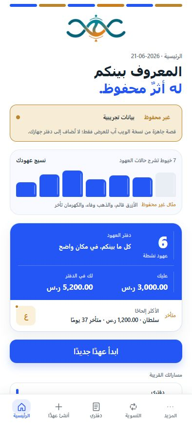
</p>
<p align="center"><sub>الرئيسية: 7 خيوط، 6 عهود نشطة، وما لك وما عليك، وتنبيه سلطان المتأخر 37 يومًا.</sub></p>

<p align="center">
  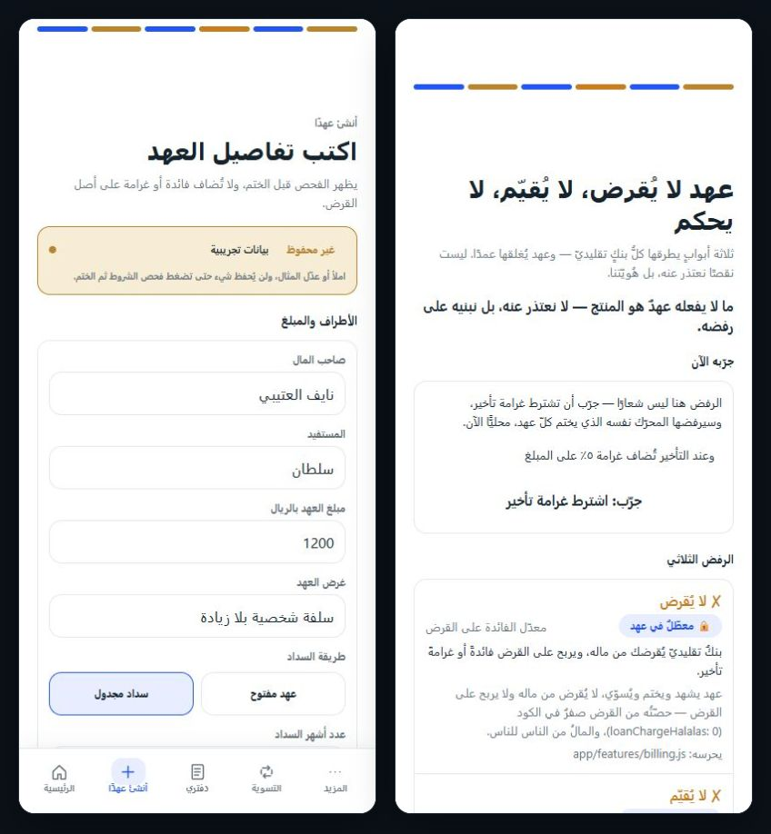
</p>
<p align="center"><sub>اكتب عهدًا، وافحص الشرط قبل الختم؛ عهد لا يُقرض، ولا يقيّم، ولا يحكم.</sub></p>

<p align="center">
  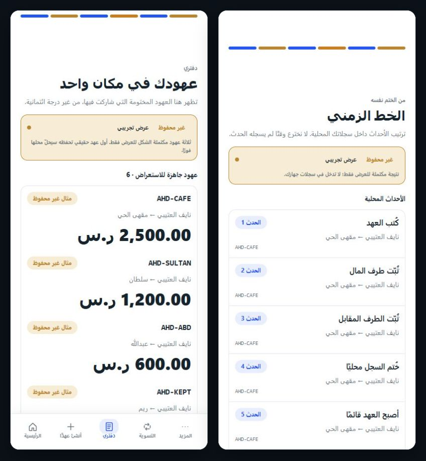
</p>
<p align="center"><sub>دفتري يجمع العهود، والسجل يشرح كل انتقال من المسودة إلى الختم والسداد.</sub></p>

<p align="center">
  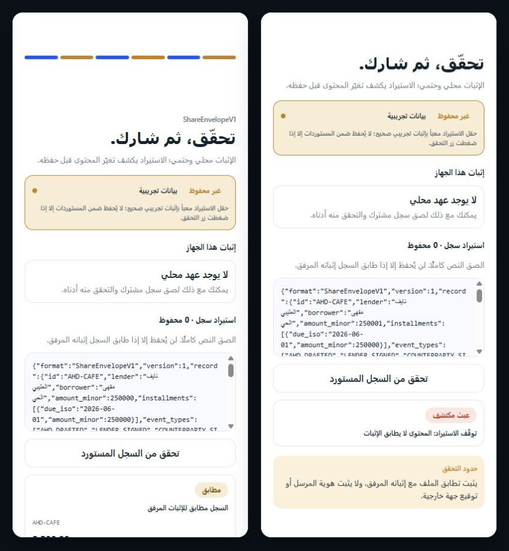
</p>
<p align="center"><sub>غيّر المبلغ من 2,500.00 إلى 2,500.01 ر.س؛ يتوقف الاستيراد فورًا لأن المحتوى لم يعد يطابق الإثبات.</sub></p>

<p align="center">
  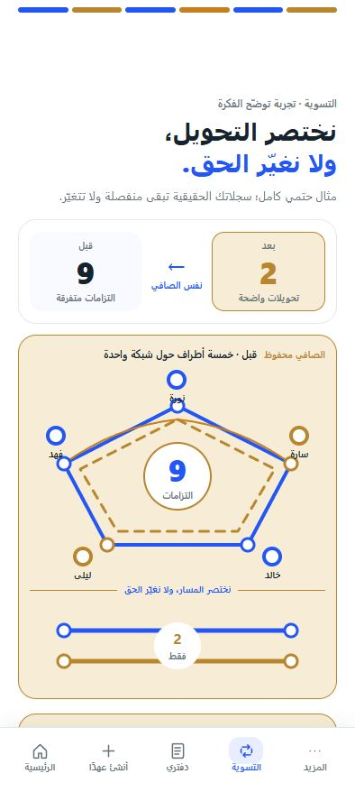
  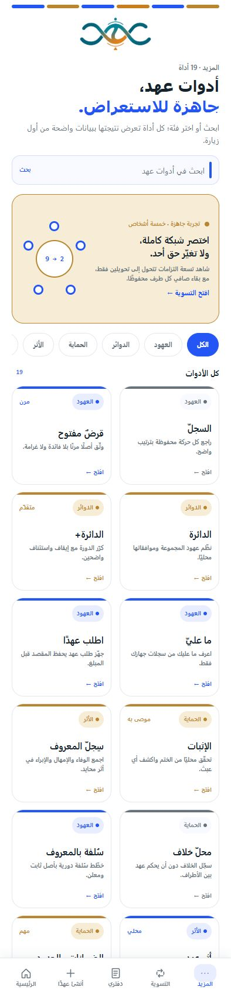
</p>
<p align="center"><sub>المقاصّة تختصر 9 التزامات إلى تحويلين من دون تغيير صافي أحد · فهرس حيّ يفتح 19 أداة عاملة.</sub></p>

### العهود والقروض والدوائر

<p align="center">
  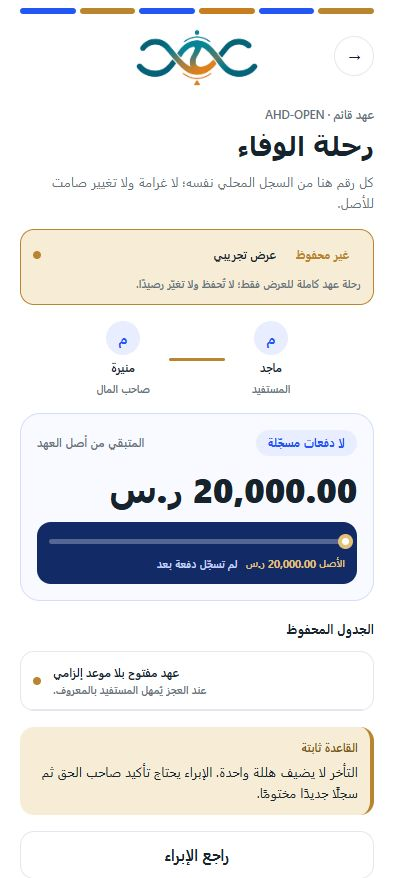
  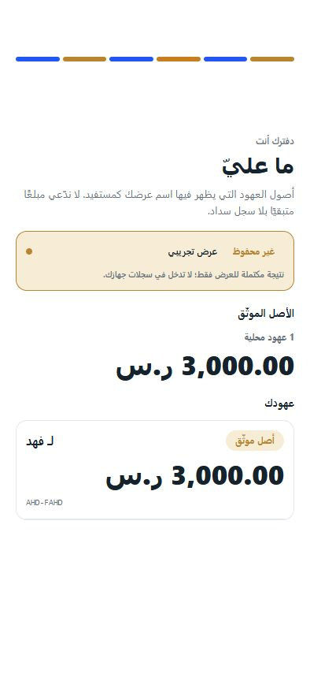
  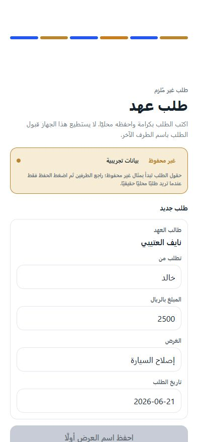
</p>
<p align="center"><sub>قرض مفتوح بـ20,000 ر.س · ما عليك في مكان واضح · طلب عهد يحفظ كرامة السائل.</sub></p>

<p align="center">
  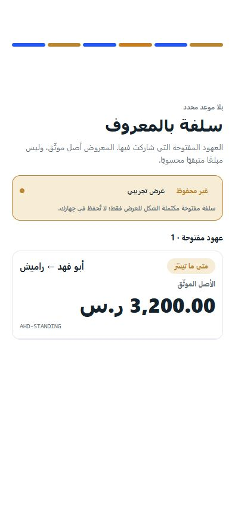
  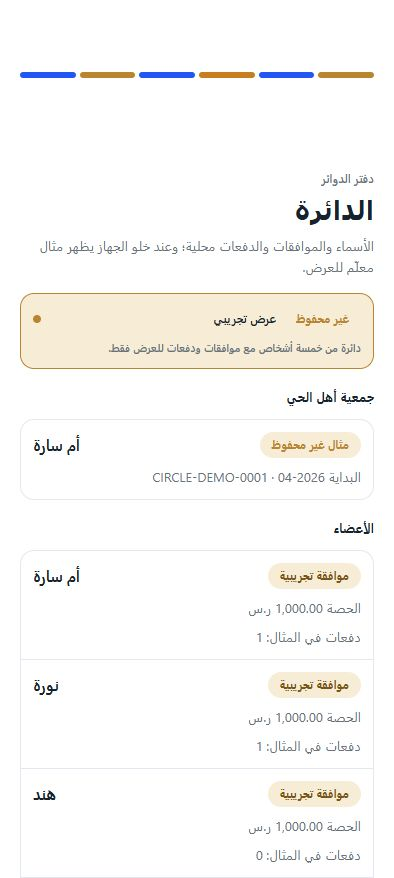
  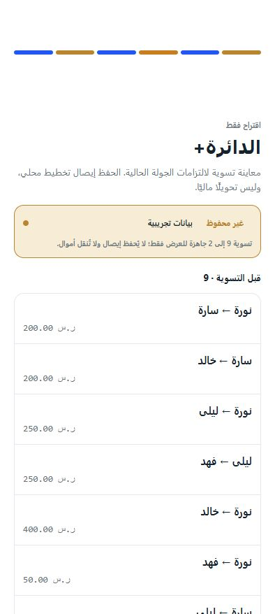
</p>
<p align="center"><sub>عهد قائم متكرر · دائرة بأمين واضح · دائرة متقدمة تعرض الالتزامات قبل التسوية.</sub></p>

<p align="center">
  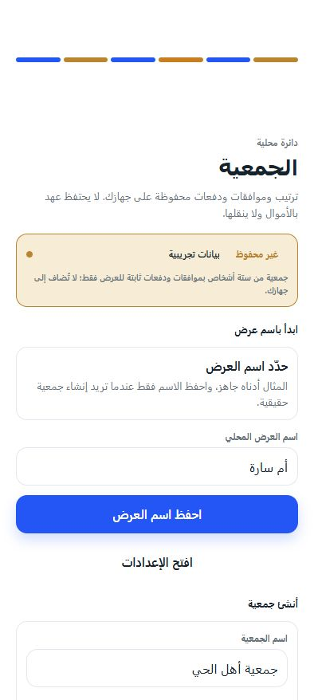
  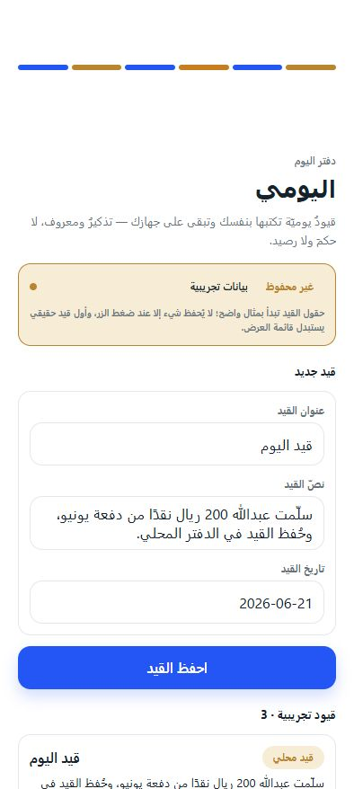
  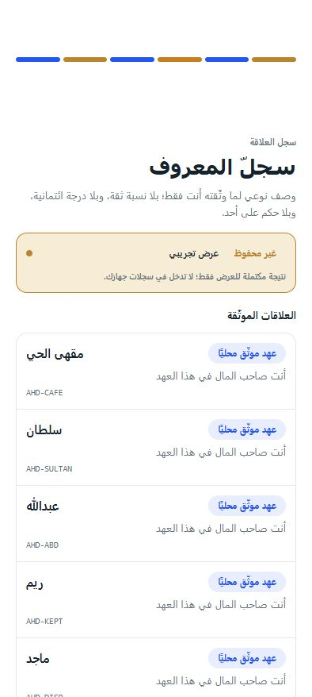
</p>
<p align="center"><sub>جمعية من 6 أعضاء · قيد يومي خفيف · سجل للوفاء والإمهال والإبراء.</sub></p>

<p align="center">
  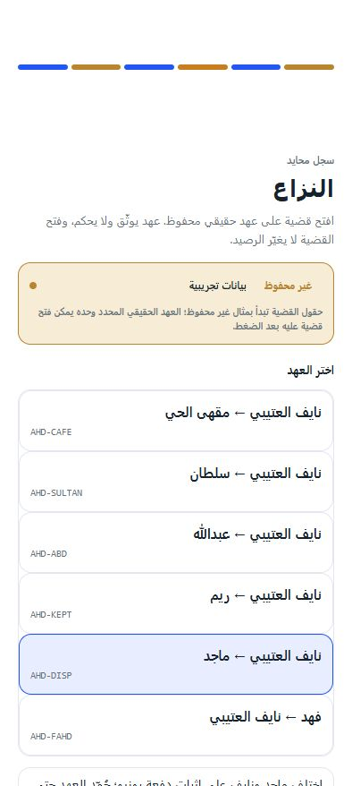
  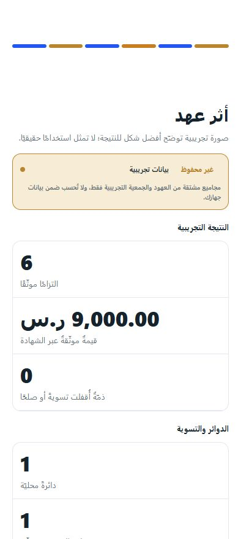
</p>
<p align="center"><sub>عهد يشهد ولا يحكم، والصلح أولًا · الأثر المقاس منفصل بوضوح عن المثال التوضيحي.</sub></p>

### الحدود والأساس الشرعي والتشغيل

<p align="center">
  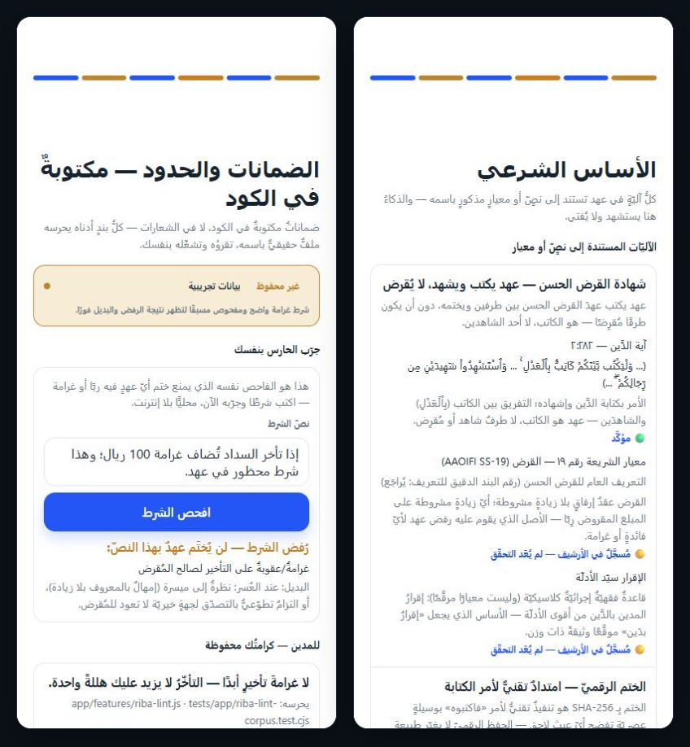
</p>
<p align="center"><sub>فاحص الربا يرفض غرامة التأخير، والأساس الشرعي يعرض الآيات والمعايير وحدود الاستدلال.</sub></p>

<p align="center">
  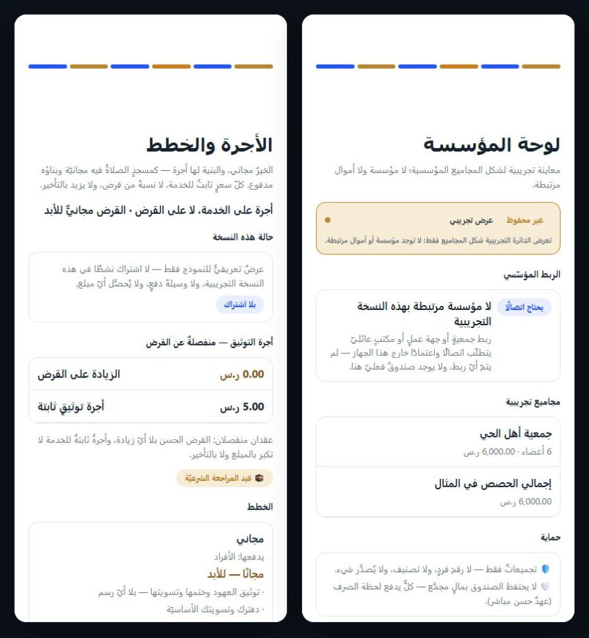
</p>
<p align="center"><sub>أجرة خدمة ثابتة منفصلة عن القرض · مسار للمنظمات بلا حيازة أموال.</sub></p>

<p align="center">
  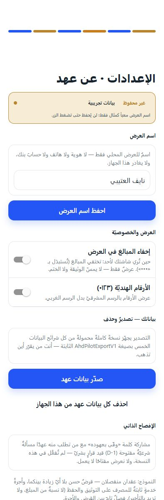
</p>
<p align="center"><sub>اسم عرض محلي، إخفاء المبالغ، أرقام إنجليزية، تصدير كامل، وحذف بيانات الجهاز.</sub></p>

### الديوان — نسخة الحاسوب

واجهة مكتبية عربية في صفحة واحدة، تعمل دون إنترنت وتستعرض أحدث خدمات عهد: النظرة العامة، دفتري، المقاصّة، وثيقة الإثبات والختم، فهرس القدرات، والإعدادات.

<p align="center">
  <a href="https://notmarwan.github.io/ahd/webapp/"></a>
  <a href="https://notmarwan.github.io/ahd/webapp/"></a>
</p>

<p align="center">
  <a href="https://notmarwan.github.io/ahd/webapp/"></a>
  <a href="https://notmarwan.github.io/ahd/webapp/"></a>
</p>

[افتح الديوان مباشرة في المتصفح](https://notmarwan.github.io/ahd/webapp/) · [تشغيل دون إنترنت](webapp/index.html) · [عرض أمد 2026](docs/pitch/ahd-amad-2026.pdf)

## جرّبه في ثلاثين ثانية

```powershell
node app/_serve-app.cjs
```

ثم افتح `http://localhost:8124` — يعمل كاملًا دون اتصال، لا تثبيت ولا بناء.

**وعلى الجوال:** تطبيق أندرويد تجريبي جاهز — [`ahd-pilot-v1.apk`](application/ahd-mobile/artifacts/ahd-pilot-v1.apk) (مع بصمة تحقق بجانبه).

## لماذا تثق بما تراه؟

- **3,425 فحصًا آليًا** تمرّ كلها بأمر واحد: `cd tests && node run-all.cjs` — النتيجة `AHD GATE ✅ 3425/0`.
- **أداة تحقق مستقلة** ([`protocol/verify-ahd-seal.cjs`](protocol/verify-ahd-seal.cjs)) تتحقق من أيّ سجل مختوم دون الرجوع إلى التطبيق نفسه.
- المنطق حتمي بالكامل: أموال بالهللة الصحيحة، لا عشوائية، لا وقت متغيّر — النتيجة نفسها في كل تشغيل.

<details>
<summary><strong>الحدود الحالية</strong></summary>

هذا نموذج أولي محلي، وليس خدمة سحابية أو منتجًا مصرفيًا جاهزًا للإطلاق.

لا يدّعي موافقة شرعية أو قانونية أو تنظيمية. التكاملات الخارجية، الاستضافة، وإدارة المفاتيح الإنتاجية ما زالت مسارات تحقق منفصلة.

</details>

<details>
<summary><strong>الأساس والحدود الشرعية</strong></summary>

- البقرة 2:282: كتابة الدين وحفظ تفاصيله.
- البقرة 2:280: إنظار المعسر والرحمة عند التعثر.
- المصرف يشهد ويختم ويسوّي؛ لا يُقرض من ماله، ولا يحكم في النزاع.
- لا فائدة، لا غرامة تأخير، لا ميسر، لا غرر مادي.
- الذكاء الاصطناعي لا يصدر فتوى. المسائل المفتوحة تُحال إلى المختصين.

</details>

<details>
<summary><strong>خريطة المستودع والعمق التقني</strong></summary>

### أين تنظر؟

| المسار | الدور |
|---|---|
| `app/` | تطبيق الويب — 23 شاشة، يعمل دون اتصال |
| `application/ahd-mobile/` | تطبيق الجوال (Expo / React Native) + APK جاهز |
| `demo/` | عرض احتياطي مجمّد ومحمي ببصمة |
| `protocol/` | أداة التحقق المستقلة ومعيار السجل المفتوح |
| `server/` | عرض خادم حيّ (ختم + تحقق عبر HTTP) |
| `tests/` | بوابة الجودة — 3,425 فحصًا |
| `docs/` | المعمارية، التصميم، الأدلة، العرض |

### خصائص المحرّك

- يعمل دون اتصال، وحتمي؛ الوقت يُحقن بقيمة ثابتة.
- الأموال أعداد صحيحة بالهللة — لا كسور عائمة أبدًا.
- لا `Date.now` ولا `Math.random` ولا `Intl` في منطق المنتج.
- التطبيق يستدعي نسخة مطابقة بايتًا-ببايت للمحرّك المجمّد، والمطابقة مُختبرة آليًا.

### التحقق

```powershell
cd tests
node run-all.cjs
```

```text
AHD GATE ✅ 3425/0
```

المزيد: [المعمارية](docs/ARCHITECTURE.md) · [تصميم المنتج](docs/DESIGN.md) · [مواصفة المنتج](docs/PUBLISHABLE-PRODUCT-SPEC.md) · [معيار السجل المفتوح](docs/specs/open-witness-v1.md)

</details>
