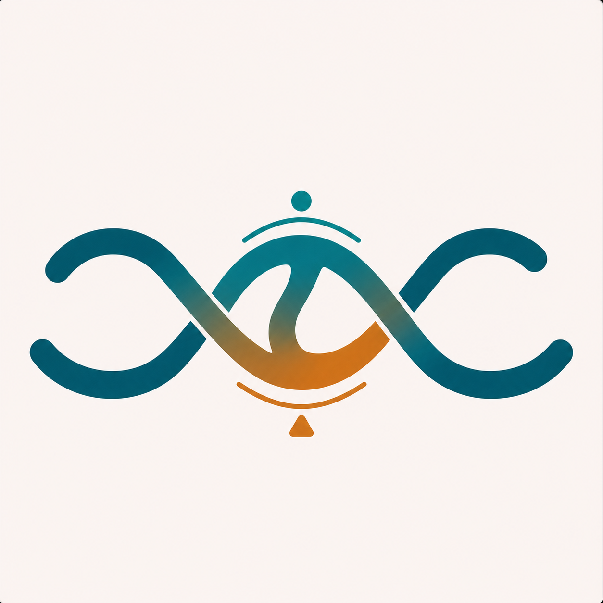
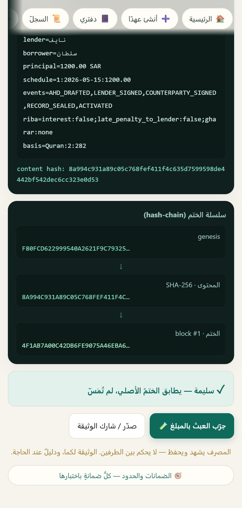
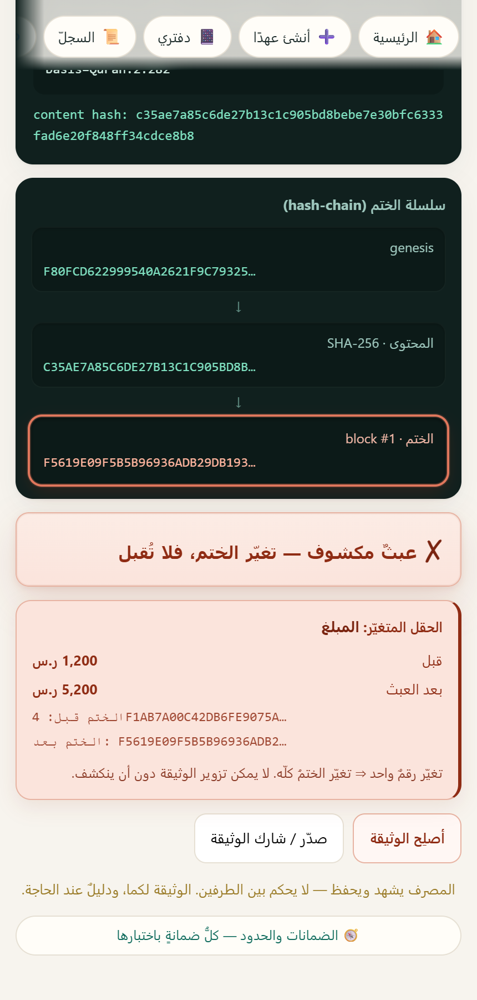
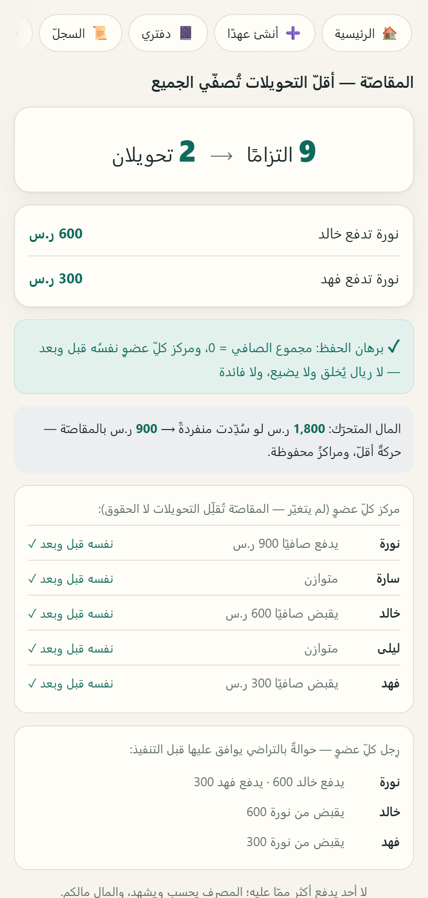

<p align="center">
  
</p>

<h1 align="center">عهد · Ahd</h1>

<p align="center"><strong>يشهد… لا يُقرض.</strong></p>

<p align="center">
بنك شاهد محايد يوثّق القرض الحسن بين الأفراد، يختمه، يكشف العبث به، ويختصر تسويته — بلا فائدة، بلا غرامة، بلا تقييم ائتماني.
</p>

<p align="center"><sub>A neutral bank witness for interest-free interpersonal loans: record, seal, verify, and settle.</sub></p>

## المشكلة

القرض بين الأقارب والأصدقاء يبدأ بالثقة. لكن الوعد الشفهي لا يحفظ التفاصيل، والتأخر قد يحوّل اختلاف الذاكرة إلى خلاف أو خسارة علاقة.

«عهد» يحفظ الحق والعلاقة معًا: يكتب ما اتفق عليه الطرفان، يمنع شرط الفائدة والغرامة قبل الختم، ويترك الحكم لأصحابه والجهات المختصة.

## كيف يعمل عهد؟

**1. يوثّق**

يُسجّل الطرفان المبلغ والموعد والشروط. يفحص النظام النص قبل الختم، ويرفض الفائدة وغرامة التأخير.

**2. يختم ويكشف العبث**

يُنتج سجلًا مختومًا يمكن التحقق منه. تغيير المبلغ أو الشروط بعد الاتفاق يظهر فورًا.

**3. يُقاصّ بالتراضي**

يختصر شبكة الديون مع إبقاء صافي حق كل شخص كما هو. المثال المبني يحوّل **9 التزامات** إلى **تحويلين**؛ لا ريال يُخلق أو يضيع.

<p align="center">
  
  
  
</p>

## ما الذي بُني؟

- تطبيق عربي يعمل دون اتصال، ويعرض رحلة التوثيق والختم والرحمة والمقاصّة.
- ختم حتمي مبني على `SHA-256` مع أداة تحقق مستقلة وسجل قابل لاكتشاف العبث.
- محرّك مقاصّة يحفظ صافي المراكز بدقة الهللة ولا يستخدم أموالًا عائمة.
- تجربة تحفظ الكرامة: لا تشهير، لا عدّاد تأخير، لا غرامة، لا درجة ائتمانية.
- بوابة جودة متحققة: `AHD GATE ✅ 3175/0`، والعرض المجمّد محفوظ ببصمته.

## جرّبه

```powershell
node app/_serve-app.cjs
```

ثم افتح:

```text
http://localhost:8124
```

لا تثبيت. لا بناء. لا اتصال مطلوب.

<details>
<summary><strong>الحدود الحالية</strong></summary>

هذا نموذج أولي محلي، وليس خدمة سحابية أو منتجًا مصرفيًا جاهزًا للإطلاق.

لا يدّعي موافقة شرعية أو قانونية أو تنظيمية. التكاملات الخارجية، الاستضافة، وإدارة المفاتيح الإنتاجية ما زالت مسارات تحقق منفصلة.

</details>

<details>
<summary><strong>الأساس والحدود الشرعية</strong></summary>

- البقرة 2:282: كتابة الدين وحفظ تفاصيله.
- البقرة 2:280: إنظار المعسر والرحمة عند التعثر.
- المصرف يشهد ويختم ويسوّي؛ لا يُقرض من ماله، ولا يحكم في النزاع.
- لا فائدة، لا غرامة تأخير، لا ميسر، لا غرر مادي.
- الذكاء الاصطناعي لا يصدر فتوى. المسائل المفتوحة تُحال إلى المختصين.

</details>

<details>
<summary><strong>العمق التقني</strong></summary>

### سطحان، محرّك واحد

| المسار | الدور |
|---|---|
| `app/` | التطبيق النشط متعدد الشاشات |
| `demo/` | عرض احتياطي مجمّد ومحمي ببصمة |
| `protocol/` | أداة تحقق مستقلة للسجل المختوم |
| `tests/` | بوابة الجودة الكاملة |

خصائص المحرّك:

- يعمل دون اتصال.
- حتمي؛ الوقت يُحقن بقيمة ثابتة.
- الأموال أعداد صحيحة بالهللة.
- لا يستخدم `Date.now` أو `Math.random` أو `Intl` في منطق المنتج.
- التطبيق يستدعي نسخة مطابقة للمحرّك المجمّد، وتُختبر المطابقة آليًا.

### التحقق

```powershell
cd tests
node run-all.cjs
```

النتيجة المرجعية الحالية:

```text
AHD GATE ✅ 3175/0
```

المزيد:

- [معمارية المشروع](docs/ARCHITECTURE.md)
- [تصميم المنتج](docs/DESIGN.md)
- [مواصفة المنتج](docs/PUBLISHABLE-PRODUCT-SPEC.md)
- [معيار السجل المفتوح](docs/specs/open-witness-v1.md)

</details>
