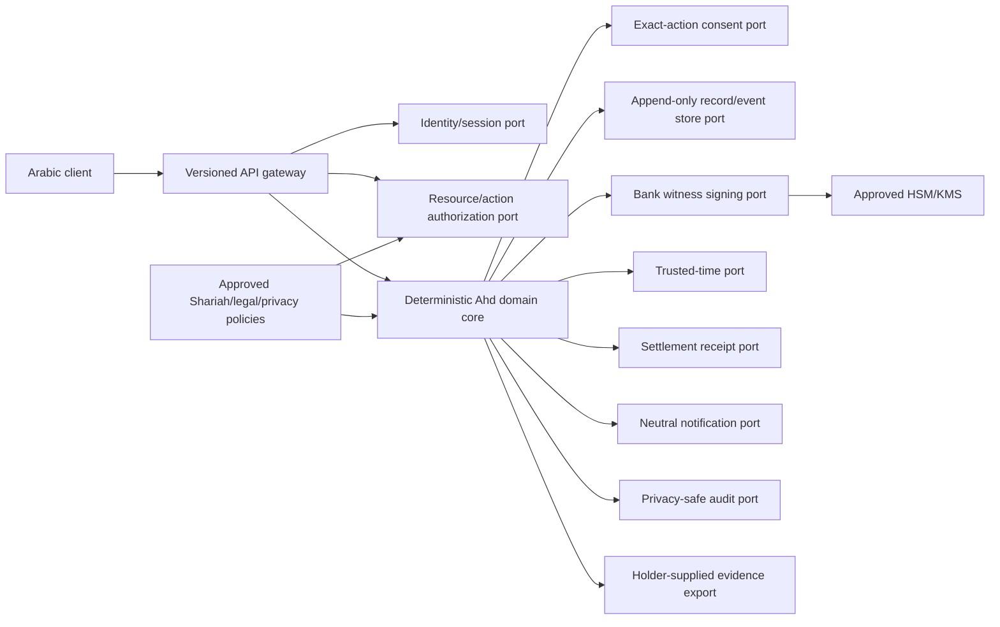

# Contract: Ahd Production Seams v1

**Contract ID**: `ahd-production-seams-v1-draft`

**Lifecycle**: `EXTERNAL-GATED`

**Activation rule**: Every seam is disabled until its owner, policy, provider evidence, conformance
tests, operations evidence, and rollback path are approved. A code adapter alone does not close a gate.

## Architecture Rule

Production infrastructure is additive around the deterministic domain core. No adapter may modify
frozen canonical v1 bytes, golden functions, existing seals, integer-money rules, or offline prototype
behavior.



## Required Ports

### Identity and Session Port

Input: provider assertion plus requested assurance context.

Output: opaque authenticated subject, assurance level, provider transaction reference, issued/expiry
time, and verification status.

Rules:

- no raw biometric storage;
- no raw national ID in domain records;
- provider use case must explicitly permit private interpersonal-debt witnessing;
- session auth does not grant resource/action authority;
- missing, expired, revoked, or invalid assertion fails closed.

### Resource and Action Authorization Port

Input: authenticated subject, resource, action, current immutable version, and policy context.

Output: allow/deny, policy version, reason code safe for the caller, and audit reference.

Minimum rules:

- lender/borrower relationship checked against the record;
- only affected parties consent to create/replace/net/reconcile;
- only lender may forgive;
- all affected parties authorize committed netting;
- operators have explicit bounded roles;
- deny by default;
- authorization cannot inspect or emit a trust score.

### Exact-Action Consent Port

Input: party, action, exact displayed-content digest, profile/version, and challenge.

Output: immutable party-attestation reference and verification evidence.

Rules:

- what-you-see-is-what-you-sign;
- any covered-content change invalidates prior consent;
- replay/nonce protection;
- both-party consent before sealing or replacement;
- provider evidence retained under approved policy;
- a hash-derived label is not a live signature verification.

### Record and Event Store Port

Input: idempotent command, expected version, immutable header/event, authorization evidence.

Output: committed sequence/version and audit reference.

Rules:

- append-only authoritative events;
- optimistic concurrency or equivalent conflict control;
- idempotency key on every mutation;
- encrypted storage and transport;
- Saudi residency includes primary data, backups, logs, telemetry, DR copies, support access, and
  subprocessors;
- tested backup, restore, RPO/RTO, migration, retention, legal hold, export, and deletion outcomes;
- no silent rewrite of sealed evidence or old events.

### Bank Witness Signing Port

Input: versioned evidence-attestation digest and signing policy.

Output: algorithm, signature, non-exportable key ID/version, certificate/policy reference, and status.

Rules:

- separate signing, session, encryption, and audit key domains;
- approved non-exportable HSM/KMS custody;
- documented key ceremony, separation of duties, rotation, revocation, recovery, and old-evidence
  verification;
- no demo private key or local HMAC key in production.

### Trusted-Time Port

Input: the approved versioned attestation digest.

Output: TSA token, provider/certificate/policy reference, provider transaction ID, time, and validation
status.

Rules:

- accredited/approved provider evidence required;
- intact, malformed, expired, revoked, and unavailable paths tested;
- unavailable TSA keeps evidence provisional or rejects the operation according to approved policy;
- a later token never proves an earlier signing time;
- timestamp target must be one canonical design. Current historical terms-hash/seal differences must be
  resolved before implementation.

### Settlement Receipt Port

Input: consented settlement leg, payer/payee references, amount halalas, currency, idempotency key.

Output: external rail receipt or explicit failure/pending state.

Rules:

- Ahd does not lend principal;
- rail execution is separate from proposal calculation;
- exact amount/currency and duplicate protection;
- reconciliation and reversal policy approved;
- no charge or penalty is added to the loan;
- failures do not silently mark a leg settled.

### Notification Port

Input: approved neutral template, recipient, cadence state, privacy context.

Output: provider receipt and sanitized delivery status.

Rules:

- finite cadence and cooldown;
- dispute/closure/final-step stop conditions;
- no public identification, threat, added amount, score, or inferred hardship;
- grace and accessibility paths remain available;
- message-provider metadata follows approved retention and residency policy.

### Audit and Monitoring Port

Input: security/operations event with field classification.

Output: tamper-evident audit reference and alert result.

Rules:

- no raw secrets, tokens, biometrics, unnecessary terms, trust bands, or hardship narrative in logs;
- actor, policy, decision, resource pseudonym, outcome, correlation, and evidence version where needed;
- monitored authz denials, replay, enumeration, riba-rule bypass, export misuse, key events, and provider
  failures;
- incident ownership, severity, response, notification, recovery, and evidence preservation defined.

### Evidence Export and Verification Port

Input: authorized holder request or holder-supplied bundle.

Output: versioned neutral evidence bundle or verification result.

Rules:

- open verification does not imply public record discovery;
- no public list or existence oracle;
- generic unavailable/not-authorized behavior where enumeration risk exists;
- independent offline verification remains possible;
- bundle states identity/time/signature/legal limitations explicitly;
- no Ahd verdict.

## Cryptographic Layering

```text
canonical record profile
  -> deterministic SHA-256 canonical hash
  -> deterministic v1 seal
  -> party action-attestation references
  -> versioned evidence-attestation digest
  -> bank witness signature (approved HSM/KMS)
  -> trusted-time token over the attestation digest
```

Each layer declares algorithm/profile version and verification status. Revocation of an external key
or certificate changes attestation status; it never rewrites historical canonical bytes.

## API Control Contract

Exact production numeric limits require load/pilot evidence. The behavioral contract is binding now:

- budgets by endpoint, tenant, authenticated subject, IP/network, and resource;
- mutations stricter than holder-supplied verification;
- bounded body bytes, JSON depth, string length, headers, edge count, pages, connections, concurrency,
  and execution time;
- `429` plus `Retry-After` on rate exhaustion;
- generic errors that do not reveal record existence;
- rejected requests create no business event;
- mutation idempotency key and provider transaction nonce;
- production startup fails if mandatory controls are missing;
- abuse controls cannot make repayment, grace, neutral evidence access, or dispute export conditional on
  a paid plan.

## Threat Model Scope

The formal threat model uses STRIDE and LINDDUN over:

- client and device;
- identity and trust/signature providers;
- API gateway and application service;
- event/record store;
- HSM/KMS and TSA;
- settlement rail and notification provider;
- independent verifier;
- operator/support tooling;
- logs, telemetry, analytics, backups, and disaster recovery.

Required Ahd abuse cases include forged consent, unrelated-actor sealing, unauthorized forgiveness,
unauthorized netting, evidence enumeration, trust-band export, scoring reuse, penalty injection,
canonicalization mismatch, riba-rule bypass, AI output presented as fatwa, linkability, coercive
non-repudiation, and public hardship disclosure.

## External Gate Evidence Matrix

| Gate | Minimum closure evidence | Owner class | Failure behavior |
|---|---|---|---|
| PR-001 regulatory path | Attributable regulator/inside-bank/sandbox pathway document | Regulatory owner | External launch blocked |
| PR-002 Shariah decisions | Signed review for D-1/D-3/D-6/D-7/D-8 as applicable | Qualified Shariah reviewer | Affected behavior unavailable/qualified |
| PR-003 legal/evidence/privacy | Counsel opinion covering attribution, privacy role, evidence and claims | Counsel | Legal claims remain qualified |
| PR-004 identity/signing | Approved provider use case, contract/policy, conformance results | Identity/TSP owner | Production consent disabled |
| PR-005 trusted time | Provider accreditation/policy, token retention, conformance tests | TSA owner | Evidence provisional or operation rejected |
| PR-006 key custody | HSM/KMS design, ceremonies, rotation/revocation/recovery tests | Security owner | Signing disabled |
| PR-007 hosting/residency | Region/subprocessor evidence, TLS, secrets, backup, monitoring, recovery | Platform/privacy owner | Production deployment blocked |
| PR-008 threat model | Approved STRIDE/LINDDUN model and tracked mitigations | Security/privacy owner | Security sign-off blocked |
| PR-009 abuse behavior | Approved rate/size/error/idempotency contract and tests | Security/product owner | Public API startup blocked |
| PR-010 data lifecycle | Retention, deletion, legal hold, access, export, recovery policy and tests | Privacy/legal owner | Real data blocked |
| PR-012 pilot | Cohort, consent, support, incident, success, and stop criteria | Pilot owner | Live obligations blocked |
| PR-013 charging | Approved payer, service boundary, basis, disclosures, accounting, refunds | Shariah/commercial/legal owners | Charging disabled |
| PR-014 operations | Ownership, escalation, reconciliation, DR, incident, audit runbooks | Operations owner | Service launch blocked |
| PR-015 readiness | Signed evidence register with no unresolved mandatory gate | Launch authority | Launch blocked |

## Status Transition Rule

An adapter may be implemented and tested while the capability stays `EXTERNAL-GATED`. Status changes
only when:

1. all acceptance tests pass;
2. all required evidence is attributable, dated, scoped, and verified;
3. security, privacy, legal, Shariah, and operational owners approve their portions;
4. rollback/disable behavior is tested; and
5. the launch readiness review records no pending mandatory gate as complete.
