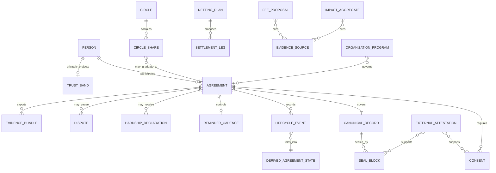

# Data Model: Ahd Product System

**Status**: Planning contract

**Date**: 2026-07-14

**Scope**: Current offline prototype, local demonstration service, Open-Witness v1, and the
boundary of future production adapters. This document does not claim that a production database,
identity provider, timestamp authority, or payment rail exists.

## Modeling Rules

1. Money is stored and processed as integer halalas. Decimal SAR exists only at a versioned input
   or display compatibility boundary.
2. A sealed fact is never edited. Later facts are append-only events or a new versioned record.
3. Derived state is recomputed from ordered valid events; it is not an independent source of truth.
4. Consent binds a party, action, exact covered-content digest, and supplied or attested time.
5. Grace is an event and projection attribute, not a persisted `GRACE` state.
6. The qualitative trust band is private, own-history-only, non-exportable, and never underwriting.
7. Identity, trusted time, bank signatures, payment receipts, and production storage are external
   attestations. The current prototype may model them but may not claim live integration.
8. Shariah, legal, regulatory, and commercial approval are evidence records, never booleans set by
   product code without documentary proof.

## Shared Scalar Types

| Type | Representation | Validation | Notes |
|---|---|---|---|
| `AhdIdV1` | Non-empty UTF-8 string | 1–128 bytes; exact byte preservation | Existing canonical profiles treat the identifier as opaque. Generation policy is versioned separately |
| `PersonRef` | Opaque string | Non-empty; no biometric material | Production mapping to an identity-provider subject is external |
| `AmountHalalas` | JSON safe integer | `0 <= value <= Number.MAX_SAFE_INTEGER` | Positive where a principal or transfer is required |
| `SignedAmountHalalas` | JSON safe integer | Absolute value within safe-integer range | Used only for net-position calculations |
| `CurrencyCode` | String enum | Current scope: `SAR` | Mixed-currency netting is forbidden |
| `CivilDate` | `YYYY-MM-DD` string | Valid Gregorian civil date | Supplied or injected; pure logic does not read a clock |
| `TimestampText` | RFC 3339 string | Offset required where used | Fixture/current input until an approved trusted-time attestation exists |
| `DigestHex256` | 64 lowercase hex chars | Exact length and alphabet | SHA-256 digest |
| `SealHex256` | 64 lowercase hex chars | Exact length and alphabet | Current hash-chain seal; not a bank signature by itself |
| `EvidenceGrade` | Enum | `PRIMARY`, `SECONDARY`, `MODELLED`, `FIXTURE`, `PROPOSED`, `MISSING` | Display label must preserve grade |
| `LifecycleStatus` | Enum | `BUILT`, `PLANNED`, `DECISION-GATED`, `EXTERNAL-GATED`, `DEMO-ONLY`, `OUT-OF-SCOPE` | Exactly one value per capability/requirement |
| `RequirementId` | String | `FR|SR|NFR|DR|PR|JR` plus three digits | Stable across artifacts |
| `DecisionId` | String | Registered `D-*` or `OT-*` ID | Cannot be invented silently in an implementation task |

### Monetary Compatibility Boundary

Open-Witness v1 and the current local demonstration accept fields such as `amount_sar` or
`amountSAR` because they reproduce pinned golden records. The boundary converts once to integer
halalas and must reject non-finite, negative, unsafe, or over-precision input. New production
contracts use `amount_minor` plus `currency: "SAR"`. Changing a canonical v1 field would create a
new profile; it may not silently alter v1.

## Relationship Model



The diagram is conceptual. It does not prescribe a production database schema.

## Entity Catalog

### 1. Person

| Field | Type | Required | Rule |
|---|---|---:|---|
| `person_ref` | `PersonRef` | Yes | Stable internal reference; never a credit-bureau key |
| `display_name` | String | Yes | Presentation data; escaped before rendering |
| `roles` | String set | Yes | Lender, borrower, organizer, member, operator, or reviewer as context permits |
| `identity_status` | Enum | Yes | `FIXTURE`, `UNVERIFIED`, `EXTERNALLY_ATTESTED` |
| `identity_attestation_ref` | Opaque string | No | Present only when documentary/provider evidence exists |

**Privacy class**: Restricted personal data.

**Invariant**: A person reference alone never proves legal identity and never authorizes an action.

### 2. Agreement

| Field | Type | Required | Rule |
|---|---|---:|---|
| `ahd_id` | `AhdIdV1` | Yes | Unique within the active profile namespace |
| `profile` | String | Yes | Versioned canonical profile |
| `type` | Enum | Yes | Current approved value: qard hasan |
| `lender_ref` | `PersonRef` | Yes | Must differ from borrower |
| `borrower_ref` | `PersonRef` | Yes | Must differ from lender |
| `principal_minor` | `AmountHalalas` | Yes | Strictly positive |
| `currency` | `CurrencyCode` | Yes | `SAR` in current scope |
| `term_kind` | Enum | Yes | `SCHEDULED` or `OPEN` |
| `months` | Positive integer | Conditional | Required only for scheduled agreements |
| `start` | Year/month value | Conditional | Required for a scheduled profile that emits labels |
| `purpose` | String | No | Must not change the qard or add consideration |
| `provenance_ref` | Opaque string | No | Source Circle share or superseded agreement |
| `lifecycle_status` | `LifecycleStatus` | Yes | Capability status, not debt repayment state |

**Privacy class**: Restricted financial and relationship data.

**Invariants**:

- The bank is not lender or borrower of principal.
- Principal never increases because of time or delay.
- Open-term agreements have no due date and no overdue state.
- Post-seal change uses events or a new linked record.

### 3. Consent

| Field | Type | Required | Rule |
|---|---|---:|---|
| `consent_ref` | Opaque string | Yes | Unique evidence reference |
| `ahd_id` | `AhdIdV1` | Yes | Agreement or proposed replacement plan |
| `party_ref` | `PersonRef` | Yes | Must be affected by the action |
| `action` | Enum | Yes | Create, seal, replace, net, reconcile, forgive, or other registered action |
| `covered_digest` | `DigestHex256` | Yes | Digest of exactly what the party saw |
| `assurance` | String | Yes | Current fixture label or approved production method |
| `signed_at` | `TimestampText` | Yes | Supplied/attested; pure logic does not create it |
| `attestation_ref` | Opaque string | No | Required for production attribution |

**Invariant**: Consent to one digest or action cannot authorize another. Silence is not consent.

### 4. Canonical Record

| Field | Type | Required | Rule |
|---|---|---:|---|
| `profile` | String | Yes | `ahd-main-v1`, `ahd-create-v1`, or a separately approved profile |
| `ahd_id` | `AhdIdV1` | Yes | Byte-preserved |
| `canonical_text` | UTF-8 string | Yes | Exact field order, separators, and newline policy defined by profile |
| `canonical_hash` | `DigestHex256` | Yes | SHA-256 of exact canonical bytes |
| `terms_hash` | `DigestHex256` | Conditional | Required where profile covers terms |
| `schema_version` | String | Yes | Immutable profile version |

**Privacy class**: Restricted evidence data.

**Invariant**: Presentation localization, digit style, masking, and UI state never alter canonical bytes.

### 5. Seal Block

| Field | Type | Required | Rule |
|---|---|---:|---|
| `seq` | Non-negative integer | Yes | Profile-defined base; current first-block fixtures use 1 |
| `prev` | `SealHex256` | Yes | Genesis or prior block seal |
| `canonical_hash` | `DigestHex256` | Yes | Covered record digest |
| `seal` | `SealHex256` | Yes | Current v1 formula output |
| `signature_attestation_ref` | Opaque string | No | Separate from hash seal; required for production bank attribution |
| `time_attestation_ref` | Opaque string | No | Separate approved trusted-time token |

**Invariant**: A matching hash seal proves covered-byte integrity under the profile. It does not by
itself prove human identity, accredited time, or bank key custody.

### 6. Lifecycle Event

| Field | Type | Required | Rule |
|---|---|---:|---|
| `event_ref` | Opaque string | Yes | Unique within event log |
| `ahd_id` | `AhdIdV1` | Yes | Parent agreement |
| `sequence` | Non-negative integer | Yes | Strict order within agreement stream |
| `event_type` | Registered enum | Yes | Unknown types fail closed or are ignored only under an explicit compatibility rule |
| `actor_ref` | `PersonRef` or operator ref | Conditional | Required when authority matters |
| `amount_minor` | `AmountHalalas` | Conditional | Payment or forgiveness amount only |
| `effective_on` | `CivilDate` | Conditional | Caller-supplied/injected |
| `payload` | Profile object | No | Type-specific, validated fields |
| `provenance_digest` | `DigestHex256` | No | Evidence binding where available |

**Invariant**: Events append. Correction uses a compensating or superseding event, never mutation.

### 7. Derived Agreement State

| Field | Type | Rule |
|---|---|---|
| `state_key` | `AgreementStateV1` | Folded from ordered events |
| `graced` | Boolean | Projection attribute set by `GRACE_GRANTED`; state remains `ACTIVE` |
| `settled_installments` | Non-negative integer | Cannot exceed total |
| `paid_minor` | `AmountHalalas` | Amount-aware projections only |
| `forgiven_minor` | `AmountHalalas` | Lender-authorized only |
| `remaining_minor` | `AmountHalalas` | Principal minus paid minus forgiven |
| `sealed` | Boolean | Derived from sealing event/profile evidence |

`AgreementStateV1` is the current golden reducer vocabulary:

```text
DRAFT
PENDING_CONSENT
WITNESSED
ACTIVE
SETTLING
KEPT
DEFAULTED
DISPUTED
ESCALATED
FORGIVEN
DECLINED
EXPIRED
VOID
```

`RESCHEDULED` is a display label for `ACTIVE` with `graced=true`; it is not persisted. The
open-term projection additionally uses `PARTIAL` to describe a remaining balance after payment or
partial forgiveness. That projection does not extend the golden agreement enum.

**Conservation invariant**:

```text
principal_minor = paid_minor + forgiven_minor + remaining_minor
```

### 8. Reminder Cadence

| Field | Type | Rule |
|---|---|---|
| `ahd_id` | `AhdIdV1` | Parent obligation |
| `tier` | Registered finite enum | Never unbounded escalation |
| `last_sent_on` | `CivilDate` | Injected/supplied |
| `cooldown_days` | Non-negative integer | Deterministic civil-day comparison |
| `stopped` | Boolean | True after final step, closure, dispute, or other stop condition |
| `stop_reason` | Enum | Closed, disputed, final-step, or owner-disabled |

**Invariant**: Reminder output contains no added amount, threat, public shame, or inferred hardship.

### 9. Hardship Declaration

| Field | Type | Rule |
|---|---|---|
| `declaration_ref` | Opaque string | Unique evidence reference |
| `debtor_ref` | `PersonRef` | Self-declared; never inferred |
| `creditor_ref` | `PersonRef` | Optional for blanket display, required to affect a specific leg |
| `creditor_consent` | Boolean | Strict `true` required by current mercy-first mechanism |
| `witnessed_at` | `TimestampText` | Supplied fixed value in current prototype |
| `reason_code` | Optional enum | User choice; no public reason required |

**Privacy class**: Highly restricted sensitive relationship data.

**Invariant**: Amount, history, or trust band cannot decide whether hardship is accepted.

### 10. Circle

| Field | Type | Rule |
|---|---|---|
| `circle_id` | Opaque string | Unique occasion/cycle container |
| `organizer_ref` | `PersonRef` | Authorized coordinator |
| `occasion` | String | Escaped display text |
| `members` | Ordered `PersonRef` list | Stable deterministic order |
| `mode` | Enum | Current approved behavior is individually attributable shares |
| `pool_held_by_ahd` | Boolean | Must be `false` in approved scope |
| `review_status` | `LifecycleStatus` | Collect-before-spend stays decision-gated |

### 11. Circle Share

| Field | Type | Rule |
|---|---|---|
| `share_id` | Opaque string | Unique per member/item/cycle |
| `circle_id` | Opaque string | Parent Circle |
| `debtor_ref` | `PersonRef` | Never the same as creditor/payer |
| `creditor_ref` | `PersonRef` | Individually attributable |
| `amount_minor` | `AmountHalalas` | Exact deterministic allocation |
| `cycle_id` | Opaque string | Required for recurring shares |
| `events` | Event references | Derive member state |
| `graduated_ahd_id` | `AhdIdV1` | Optional; requires new consented agreement |

**Invariant**: The sum of shares equals the exact assigned total. No member owes themselves.

### 12. Netting Plan

| Field | Type | Rule |
|---|---|---|
| `plan_ref` | Opaque string | Deterministic proposal reference |
| `currency` | `CurrencyCode` | One currency per plan |
| `input_edges_digest` | `DigestHex256` | Binds original obligations |
| `algorithm_profile` | String | Current golden deterministic algorithm |
| `status` | Enum | `PROPOSED`, `CONSENT_PENDING`, `COMMITTED`, `VOID` |
| `required_party_refs` | Ordered list | Every affected party |
| `consent_refs` | Ordered list | Must cover exact plan digest |

**Invariant**: A plan is not settlement until all affected consent is complete. Net positions are exact.

### 13. Settlement Leg

| Field | Type | Rule |
|---|---|---|
| `leg_ref` | Opaque string | Unique within plan |
| `plan_ref` | Opaque string | Parent plan |
| `from_ref` | `PersonRef` | Differs from recipient |
| `to_ref` | `PersonRef` | Differs from sender |
| `amount_minor` | `AmountHalalas` | Strictly positive |
| `currency` | `CurrencyCode` | Matches plan |
| `order` | Non-negative integer | Deterministic tiebreak order |
| `execution_attestation_ref` | Opaque string | Optional in prototype; required before production settlement claim |

### 14. Dispute

| Field | Type | Rule |
|---|---|---|
| `dispute_ref` | Opaque string | Unique case reference |
| `ahd_id` | `AhdIdV1` | Affected obligation |
| `raised_by` | `PersonRef` | Must be an affected party |
| `raised_event_ref` | Opaque string | Append-only provenance |
| `affected_actions` | Enum set | Reminder and settlement pause at minimum |
| `resolution_path` | Enum | `PENDING`, `RECONCILIATION`, `COURT_EXPORT`, `WITHDRAWN` |
| `verdict` | None | Ahd never stores or issues its own verdict |

### 15. Evidence Bundle

| Field | Type | Rule |
|---|---|---|
| `bundle_ref` | Opaque string | Export reference |
| `ahd_id` | `AhdIdV1` | Covered agreement |
| `profile` | String | Versioned bundle schema |
| `canonical_record` | Object | Exact covered fields |
| `seal_chain` | Seal blocks | Complete for declared scope |
| `event_history` | Lifecycle events | Ordered and provenance-preserving |
| `verification_result` | Object | Recomputed result; fail closed |
| `limitations` | String list | Identity/time/legal gaps stated |

**Invariant**: The bundle contains neutral evidence, not a legal or factual judgment.

### 16. Trust Band

| Field | Type | Rule |
|---|---|---|
| `subject_ref` | `PersonRef` | Same person as authorized viewer in current scope |
| `band_key` | Enum | `kept`, `mixed`, `overdue`, `new` |
| `word_ar` | String | Qualitative approved label only |
| `basis_window_ref` | Internal opaque ref | Never exported |
| `exportable` | Boolean | Must be `false` unless D-1 is approved; current scope remains false |
| `underwriting_allowed` | Boolean | Always `false` |

**Invariant**: No numeric value, rank, percentile, third-party lookup, bureau export, or credit decision.

### 17. Impact Aggregate

| Field | Type | Rule |
|---|---|---|
| `aggregate_ref` | Opaque string | Stable report row |
| `metric_key` | Registered string | Definition is documented |
| `value_minor_or_count` | Integer | Money remains halalas; counts are integers |
| `cohort_size` | Non-negative integer | Required for privacy check |
| `privacy_floor` | Positive integer | Publish only when floor is met |
| `evidence_grade` | `EvidenceGrade` | Visible with output |
| `source_refs` | List | Complete provenance |
| `suppressed` | Boolean | True when unsafe to display |

### 18. Evidence Source

| Field | Type | Rule |
|---|---|---|
| `source_ref` | Opaque string | Stable citation ID |
| `title` | String | Human-readable |
| `publisher` | String | Named source |
| `period` | String | Data/reference period, not only publication date |
| `geography` | String | Exact scope |
| `grade` | `EvidenceGrade` | Cannot be upgraded without new evidence |
| `locator` | String | Repository path or URL |
| `claim_ids` | List | Claims supported by this source |
| `limitations` | String list | Category, age, sample, model, or applicability limits |

### 19. Fee Proposal

| Field | Type | Rule |
|---|---|---|
| `proposal_ref` | Opaque string | Stable proposal ID |
| `service_boundary` | String | Separate actual service, not principal/time increase |
| `payer_role` | Enum or `UNDECIDED` | Must be approved under D-6 |
| `amount_minor` | `AmountHalalas` | Proposed fixed amount only |
| `basis` | Enum | Direct cost or other reviewed basis |
| `linked_to_principal` | Boolean | Must be `false` |
| `linked_to_delay` | Boolean | Must be `false` |
| `review_status` | Enum | `PROPOSED`, `SHARIAH_PENDING`, `APPROVED`, `REJECTED` |
| `decision_ref` | `DecisionId` | D-6 |

**Invariant**: Proposal data never authorizes charging. Core repayment, grace, evidence, and dispute
export cannot be paywalled.

### 20. Organization Program

| Field | Type | Rule |
|---|---|---|
| `program_ref` | Opaque string | Stable proposed program |
| `operator_ref` | Opaque organization ref | Named authority required |
| `payer_role` | Enum or `UNDECIDED` | Explicit before approval |
| `participant_scope` | String | Bounded cohort |
| `permitted_aggregates` | Metric-key list | No individual trust bands |
| `data_access_policy_ref` | Opaque string | Approved policy required |
| `review_status` | `LifecycleStatus` | Current behavior remains decision-gated/demo |

### 21. External Attestation

| Field | Type | Rule |
|---|---|---|
| `attestation_ref` | Opaque string | Stable evidence reference |
| `kind` | Enum | Identity, consent signature, trusted time, bank signature, payment receipt, regulatory, Shariah, legal, residency, or operational |
| `provider_ref` | Opaque string | Provider/reviewer identity |
| `subject_digest` | `DigestHex256` | Exact content/evidence binding |
| `issued_at` | `TimestampText` | Provider-supplied |
| `expires_at` | `TimestampText` | Optional; enforced when present |
| `verification_status` | Enum | `UNVERIFIED`, `VALID`, `INVALID`, `EXPIRED`, `REVOKED` |
| `verification_evidence` | Opaque locator | Required to move a gate |
| `limitations` | String list | Scope and jurisdiction |

**Invariant**: Missing, expired, invalid, or revoked evidence fails closed. A screenshot, fixture,
draft email, or code adapter is not an attestation.

## State Transition Contract

| From | Event | Authorized actor | To/projection | Guard |
|---|---|---|---|---|
| None | `AHD_DRAFTED` | Initiating party/operator | `DRAFT` | Valid distinct parties and positive known principal |
| `DRAFT` | `LENDER_SIGNED` | Lender | `PENDING_CONSENT` | Exact content digest bound |
| `PENDING_CONSENT` | `RECORD_SEALED` then `ACTIVATED` | Both parties plus witness operator | `WITNESSED` then `ACTIVE` | Screening clean; all required consent present |
| `ACTIVE` | `GRACE_GRANTED` | Lender after request/offer | `ACTIVE`, `graced=true` | No increase; remaining conserved |
| `ACTIVE` | payment event | Paying party/evidence | `ACTIVE` or `KEPT` | Amount does not exceed remaining |
| `ACTIVE` | forgiveness event | Lender | `ACTIVE` or `FORGIVEN` | Amount does not exceed remaining |
| `ACTIVE` | `SETTLEMENT_INITIATED` | Affected parties/operator proposal | `SETTLING` | Proposal only until consent complete |
| `SETTLING` | settlement accepted | All affected parties | `ACTIVE` or `KEPT` | Exact conservation |
| Active state | `DISPUTE_RAISED` | Either affected party | `DISPUTED` | Reminder and settlement pause |
| `DISPUTED` | reconciliation record | Both affected parties | Reconstructed lawful state | No Ahd verdict; replacement terms re-consented |
| Active state | `FORGIVEN` | Lender | `FORGIVEN` | Explicit lender action |
| Pre-activation | `DECLINED` or `EXPIRED` | Authorized party/policy | Closed pre-activation state | No sealed obligation silently removed |
| Any lawful state | `VOIDED` | Profile-defined authority | `VOID` | Append-only reason and provenance |

## Forbidden Data Flows

- Trust band to lender underwriting, organization operator, bureau, public profile, or analytics.
- Raw biometric data into Ahd storage.
- Public local-server `/list` semantics into a production interface.
- Fixture identity or timestamp labels represented as live provider attestations.
- Individual agreement rows in impact analytics after the privacy floor applies.
- Fee proposal fields into collection or principal calculations.
- Dispute narrative into automated judgment or a credit signal.
- Production personal data outside an approved residency, retention, and access policy.

## Retention and Deletion Status

No production retention schedule is approved. Therefore:

- prototype fixtures are development artifacts, not user records;
- local server JSONL data is demo data and must not receive real obligations;
- sealed evidence, event histories, legal hold, correction, export, erasure limits, backup retention,
  and subject-access behavior remain `EXTERNAL-GATED` under DR-015 and PR-010;
- any production schema or storage task must stop until counsel and regulatory owners approve the
  record-category policy and documentary evidence is linked.
