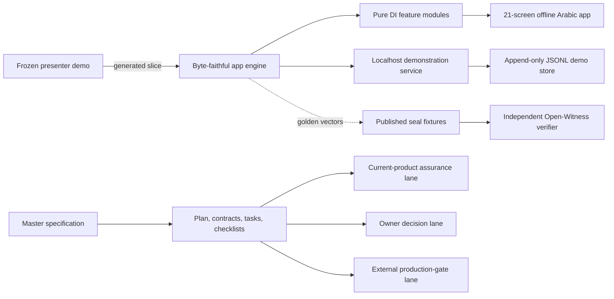

# Implementation Plan: Ahd Product System

**Branch**: `judge-lens-real-leap` | **Date**: 2026-07-14 | **Spec**: [spec.md](./spec.md)

**Input**: Approved master specification for the current prototype, target product,
decision boundaries, external gates, and improvement portfolio.

## Summary

Adopt the master specification as Ahd's product-level source of truth without rewriting
working product behavior. The plan preserves the frozen engine and offline app, formalizes the
current data and surface contracts, separates the local demonstration service from a future
production service, and decomposes remaining work into four independently gated lanes:

1. specification governance and drift detection;
2. current-product and Open-Witness verification;
3. decision packets for Shariah, privacy, legal, and commercial owners; and
4. production-readiness controls that remain disabled until documentary evidence closes each gate.

Implementation begins with documentation and automated traceability, not production integrations.
Any later behavior change follows TDD in a focused feature module and may not modify the frozen demo
or golden function internals.

## Planning Baseline

| Baseline fact | Planning consequence |
|---|---|
| The app registry contains 21 screens and the navigator maps 35 feature units | Inventories are derived from registries, never copied as untested prose |
| The master spec contains 142 uniquely identified normative requirements | Every task cites requirement IDs and one user story |
| The current full gate is green at 2,869 assertions and zero failures | Counts are snapshots; `tests/run-all.cjs` remains authoritative |
| `demo/index.html` is byte-pinned | No task edits the demo or golden functions |
| `app/` is fully offline | No production adapter is called by current app code |
| `server/` is an authenticated, durable localhost demonstration | Its API is documented as `DEMO-ONLY`, never promoted to production by wording |
| `protocol/verify-ahd-seal.cjs` is independent | No future contract may make independent verification depend on Ahd runtime code |
| D-1, D-3, D-6, D-7, and D-8 are unresolved | Affected behavior remains disabled or qualified |

## Technical Context

**Language/Version**: Browser JavaScript compatible with the current ES5-style feature modules;
Node.js 18 or newer for tests, local server, protocol verifier, and scripts; TypeScript only inside
the existing project MCP tooling.

**Primary Dependencies**: Browser DOM APIs and Node built-ins (`crypto`, `fs`, `http`, `path`). The
active app, local server, and independent verifier have no third-party runtime dependency. The MCP
and promotional tooling keep their existing isolated dependency boundaries.

**Storage**: Current app fixtures and in-memory state; append-only JSONL with fsync and torn-tail
replay for the local demonstration server; production storage is deliberately unspecified until
residency, retention, concurrency, recovery, and regulatory decisions are approved.

**Testing**: Custom Node test harness under `tests/`, focused `*.test.cjs` suites, engine parity,
offline static checks, DOM smoke tests, structure checks, live HTTP parity, Open-Witness fixtures,
and the one-command full gate.

**Target Platform**: Current Arabic RTL offline web app in a modern browser; localhost-only Node
demonstration service; zero-dependency Node verifier. Production web/mobile/service targets remain
`EXTERNAL-GATED`.

**Project Type**: Multi-surface web product prototype with a frozen reference, pure feature modules,
a separate local service proof, an independent verification protocol, project-agent tooling, and
judge/evidence documentation.

**Performance Goals**: Current deterministic feature tests remain fast enough for the one-command
gate; the three-minute judge path must complete reliably; production latency, capacity, availability,
RTO, and RPO remain approval items under NFR-016.

**Constraints**: Integer halalas; fixed/injected time; no wall-clock or random input in pure logic;
no app network calls; no golden changes; Arabic-first RTL and 44 by 44 CSS-pixel touch targets;
no score, loan charge, judgment, AI fatwa, or unsupported approval claim.

**Scale/Scope**: 21 registered app screens, 35 navigator feature units, 10 user stories, 142
normative requirements, the frozen demo, local service, independent verifier, judge package,
decision register, and production-readiness evidence lane.

## Constitution Check — Pre-Research

- [x] Ahd spine preserved; no lending, judging, loan charge, penalty, score, or AI fatwa.
- [x] Frozen demo and golden functions remain unchanged; independent verifier stays independent.
- [x] All money uses integer halalas and all pure logic is deterministic.
- [x] Consent, append-only events, neutral disputes, and dignity requirements are preserved.
- [x] Lifecycle status and evidence grade are explicit; pending gates remain pending.
- [x] TDD and the never-weaken quality gate are planned with exact commands.
- [x] Modules have focused responsibilities and traceable requirements.
- [x] Judge-visible work includes evidence-backed Judge Lens scoring.

No constitutional exception is requested. Principles I through VI are hard blockers.

## Architecture



The arrows do not authorize runtime coupling. The offline app never calls `server/`. The verifier
never imports the app, demo, or engine. Production integrations attach through future adapters only
after the named gate closes.

## Project Structure

### Documentation for This Specification

```text
specs/001-ahd-product-system/
|-- spec.md
|-- plan.md
|-- research.md
|-- data-model.md
|-- quickstart.md
|-- clarity-review.md
|-- contracts/
|   |-- product-surfaces.md
|   |-- open-witness-v1.md
|   |-- local-server-api.md
|   `-- production-seams.md
|-- checklists/
|   |-- requirements.md
|   `-- master-quality.md
`-- tasks.md
```

### Existing Source and Evidence Boundaries

```text
app/
|-- app.js                    # screen registry/router and action wiring
|-- engine.js                 # generated golden slice; never hand-edit
|-- build-engine.cjs          # extracts engine from frozen demo
|-- features/*.js             # pure, dependency-injected business modules
|-- screens/*.js              # rendering only
`-- index.html                # offline product shell

demo/index.html               # frozen presenter reference; never edit

server/
|-- engine.cjs                # adapter to app engine
|-- handlers.cjs              # pure local-demo handlers
|-- router.cjs                # deterministic route/auth dispatch
|-- auth.cjs                  # local HMAC demonstration auth
|-- store.cjs                 # local append-only JSONL demonstration store
|-- http.cjs                  # localhost binder
`-- demo-bank-node.cjs        # judge-facing terminal walkthrough

protocol/
|-- verify-ahd-seal.cjs       # independent Node crypto verifier
`-- fixtures/*.json           # golden and tampered records

tests/
|-- run-all.cjs               # authoritative complete gate
|-- structure-check.cjs       # repository boundaries and drift checks
`-- app/*.test.cjs            # feature, contract, parity, server, and protocol suites

docs/
|-- DECISIONS-FOR-MARWAN.md   # owner/Shariah decision boundary
|-- JUDGE-LENS.md             # competitive quality gate
|-- evidence/                 # claim grades and production path
`-- specs/open-witness-v1.md  # canonical current protocol standard

project/mcp/                  # project-aware agent tooling, isolated from product runtime
AmadHackathon/                # Obsidian cockpit mirror; canonical docs remain elsewhere
```

**Structure Decision**: Keep the existing multi-surface structure because each surface proves a
different property: product usability, frozen parity, server-side reuse, and independent
verification. Consolidating them would weaken offline isolation or verifier independence.

## Planned Workstreams

| Lane | Requirement families | Deliverable | Gate |
|---|---|---|---|
| L1 Specification governance | FR-001, DR-008, DR-013, DR-014, JR-004 | Machine-readable trace matrix and inventory drift checks | Full gate green |
| L2 Current product assurance | FR-002–FR-045, NFR-001–NFR-014, JR-001–JR-005 | Evidence links, focused regression checks, current documentation sync | No behavior regression |
| L3 Protocol governance | FR-042, NFR-004–NFR-005, PR-011 | Open-Witness profile registry and compatibility rules | Golden vectors and independence tests green |
| L4 Decision packets | FR-025, FR-040–FR-041, SR-011–SR-015 | D-1/D-3/D-6/D-7/D-8 review packets | Named human approval; no AI ruling |
| L5 Local-service hardening | FR-043–FR-044, PR-008–PR-009 | Threat model, body limit, abuse contract, documentation correction | Still localhost/demo-only |
| L6 Production readiness | FR-047–FR-050, NFR-016–NFR-020, PR-001–PR-015 | Adapter contracts and evidence register | Every external attestation verified |
| L7 Stage readiness | FR-045–FR-046, JR-001–JR-010 | Rehearsal evidence, labelled fallbacks, final Judge Lens review | No score below 8 |

## Phase 0: Research Decisions

`research.md` records the selected architecture and rejected alternatives. The key decisions are:

- preserve four runtime trust boundaries rather than merge them;
- treat built status as an evidence claim that must be executable;
- use opaque existing identifiers in v1 and version the future creation policy separately;
- declare the engine's lifecycle vocabulary as the current semantic registry;
- separate the localhost API contract from any production API;
- design production identity, time, key custody, and storage as fail-closed adapters;
- resolve owner and external uncertainty with evidence packets, not placeholder implementation;
- add registry-derived drift controls before expanding features.

No generated technical-clarification marker remains. Unresolved business, Shariah, legal, and vendor matters are
intentional named gates, not technical ambiguity.

## Phase 1: Design Outputs

- `data-model.md` defines shared scalar types, 21 domain entities, relations, invariants, state
  transitions, privacy classes, and retention status.
- `contracts/product-surfaces.md` defines current surface authority and runtime isolation.
- `contracts/open-witness-v1.md` points to the canonical published standard and freezes compatibility.
- `contracts/local-server-api.md` documents the actual localhost routes, auth, responses, and honest limits.
- `contracts/production-seams.md` defines fail-closed adapter behavior and evidence required to activate it.
- `quickstart.md` gives reviewers exact commands and expected results.

## Requirement-to-Delivery Rule

Every implementation task must include:

1. one or more requirement IDs from `spec.md`;
2. one independently testable user story;
3. exact files to create or modify;
4. a failing test or, for documentation-only work, an explicit validation command;
5. the lifecycle status before and after the task;
6. any blocking decision or external evidence ID; and
7. the full-gate and Judge Lens obligation when the result is visible to judges.

A task may move `PLANNED` to `BUILT` only after its acceptance criteria and executable evidence pass.
`DECISION-GATED` and `EXTERNAL-GATED` do not change status merely because an adapter or document exists.

## Constitution Check — Post-Design

- [x] Spine constraints appear in the spec, data model, contracts, tasks, and stop conditions.
- [x] No design modifies the frozen demo, golden functions, vectors, or verifier independence.
- [x] Scalar types enforce integer halalas and injected deterministic time.
- [x] Consent and event-history rules are represented as invariants, not UI suggestions.
- [x] Every unresolved approval remains a named `DECISION-GATED` or `EXTERNAL-GATED` item.
- [x] TDD, focused tests, full gate, and never-weaken rules are mandatory.
- [x] Existing module boundaries remain focused; future services enter through contracts.
- [x] Judge-visible delivery retains evidence grade and requires scoring.

## Complexity Tracking

No constitution violation is accepted. The repository has multiple execution surfaces, but they are
intentional trust boundaries rather than duplicate product implementations:

| Boundary | Why it remains separate | Simpler alternative rejected because |
|---|---|---|
| Frozen demo and publishable app | The demo is the byte-pinned parity source; the app is additive | Merging would invalidate the tripwire or freeze product work |
| Offline app and localhost service | They prove offline usability and server-side engine reuse independently | Connecting them would violate the current offline guarantee |
| Ahd runtime and Open-Witness verifier | The verifier must work without trusting Ahd code | Sharing the engine would make verification circular |
| Current service and future production seams | Current HMAC/JSONL server is a transparent demo, not an implied production stack | Calling it production would hide identity, residency, security, and operations gaps |

## Delivery Risks and Controls

| Risk | Control | Stop condition |
|---|---|---|
| Stale screen, feature, or test counts | Derive counts from registries and live gate | Any mismatch blocks documentation release |
| Accidental golden drift | Tripwire, engine parity, golden vectors | Any byte or vector drift blocks all work |
| Status inflation | Requirement-level lifecycle and evidence fields | No evidence means no move to `BUILT` |
| Shariah overreach | Named decisions and reviewer packets | No capability enablement before signed review |
| Fake production confidence | Separate local and production contracts | Missing external attestation keeps launch blocked |
| Privacy leakage | Field classification, aggregation floor, no trust export | Any identifiable analytics or score blocks release |
| Stage fragility | Preflight, current fallback media, rehearsal log | Primary path failure or stale label blocks freeze |

## Validation Commands

```powershell
git diff --check -- specs/001-ahd-product-system
$markers = @('NEEDS' + ' CLARIFICATION', '[' + 'FEATURE' + ']', '[' + 'DATE' + ']', '[' + '###')
Get-ChildItem specs/001-ahd-product-system -Recurse -File | Select-String -SimpleMatch -Pattern $markers
cd tests
node run-all.cjs
```

Expected result: no marker matches, no whitespace errors, and a green gate with the live
assertion count. `quickstart.md` contains the complete manual verification path.
